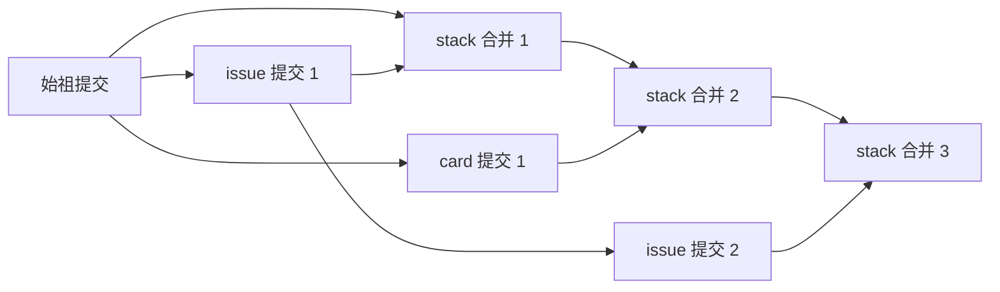

# Collections：基于 Git Branch 的可追溯分层文件存储

Collections 需要一种可追溯的分层文件存储结构：不同层分别管理自己的文件与变更，写入具有明确的层归属，读取时能够获得各层内容的统一视图，并可追溯每次修改的来源与历史。

普通文件系统的目录层级只表达路径组织，不提供这里所需的层归属、写入隔离与合并视图；Git 本身也没有这些分层存储语义。现有分层文件系统方案的引入与维护成本超出本项目的需要，因此 Collections 选择利用 Git branch、内容树和提交历史，在应用层实现这套存储结构。

具体而言，分支用于分别维护各层的内容与历史，`stack` 用于承载统一视图，路径归属规则与写入守卫用于建立层边界。**分层语义由 Collections 定义和执行，Git 提供实现这些语义所需的存储与版本管理基础。**

在这套存储结构之上，Collections 定义了三个内置认知层：`origin` 保存外部原文，`issue` 保存问题、立场与论证，`card` 保存可复用的事实词条。用户自定义层复用同一套存储机制。

## 以分支表示层

**每层有一条权威分支 `layer/<name>`，另有一条 `stack` 分支提供所有层的统一视图。** 各层从同一个始祖提交出发，分别沿自己的历史演进。新增层也从始祖开分支，因此不会带入其他层的业务内容。

| 分支 | 职责 |
| --- | --- |
| `layer/origin` | 原文及其历史；承载仓库配置 `collections.json` |
| `layer/issue` | 问题、立场、论证及其历史 |
| `layer/card` | 事实词条及其历史 |
| `layer/<自定义层>` | 由 schema 定义的对象及其历史 |
| `stack` | 汇集各层内容，提供统一读取和整体变更时间线 |

始祖提交只包含 `collections.json`，记录层清单与顺序；这份共享的初始文件归最底层管理。除此之外，各层拥有的文件路径互不相交。层的上下关系表达认知上的分工，Git 拓扑中各层分支则从同一起点独立生长。

层也不要求各占一个顶层目录。同一主题目录下可以同时有原文、`问题.issue/` 和 `结论.card/`：**目录组织主题，分支组织层的归属和历史。** 对象目录的层后缀决定路径归属，没有层后缀的普通文件归最底层。

## 一次写入如何进入统一视图

每次写入声明一个层，先通过归属守卫，再形成两个提交：

1. 在 `layer/<name>` 上提交这批修改，以该层原来的提交为父节点，保持层内历史线性。
2. 将同一批修改应用到 `stack` 的内容树，创建一个合并提交。它的第一父节点是原来的 `stack`，第二父节点是刚产生的层提交。

`stack` 的内容树由服务根据已验证的修改直接构造，保持各层当前内容的并集；合并提交的双亲关系则记录这次变化来自哪一个层提交。读取、目录浏览与检索默认面向 `stack`，调用方因此可以一次看到完整认知空间。工作区也同步到这个视图。

查看某一层的分支，可以追溯该层自身的演进；沿 `stack` 的第一父节点查看历史，可以得到整个仓库按写入顺序排列的时间线，每个合并节点对应一次层提交。

## 分层边界如何成立

Collections 为各层维护独立的分支内容与历史，并通过**路径归属守卫保证分层约束**。写入前同时检查路径按规则应归哪层，以及已有文件实际由哪层持有；修改或删除其他层的路径会被拒绝。因此，上层可以引用原文，但无法以自己的层身份改写原文。

跨层业务动作拆成各层自己的提交。例如对一张 card 开讨论页，会先提交新的 issue，再提交 card 的 `issue` 引用；业务上是一件事，历史中仍保留每层明确的责任边界。层与层之间是弱耦合：card 记它的 issue，issue 不记 card。

这套约束由服务写入入口执行，当前以服务进程作为仓库唯一写者。新增层时，只需登记 schema 并建立对应分支，即可沿用统一的读写、历史与归属机制。

## 模块分工

- [`__init__.py`](__init__.py)：业务入口，装载层定义、组织对象读写（一批文件改动 → 层的 check → 一个提交），并投递变更通知。
- [`repo.py`](repo.py)：分层仓库，维护层分支、`stack` 合并视图与路径归属守卫。
- [`git.py`](git.py)：Git 原语，封装内容树、提交、引用和历史等操作。
- [`manager.py`](manager.py)：沿目录祖先解析 `manager.json`，确定变更应交给哪个 work。
- [`catalog.py`](catalog.py)：将对象组织为目录（按目录树列标题）。

每一层就是一个校验函数 `check(diff, after)`，由 [`layers/`](layers/) 定义；没有行为，写就是写文件。本模块负责将它们放进同一个可追溯、可分层扩展的认知仓库，并通过 manager 收件箱与 work 连接。
